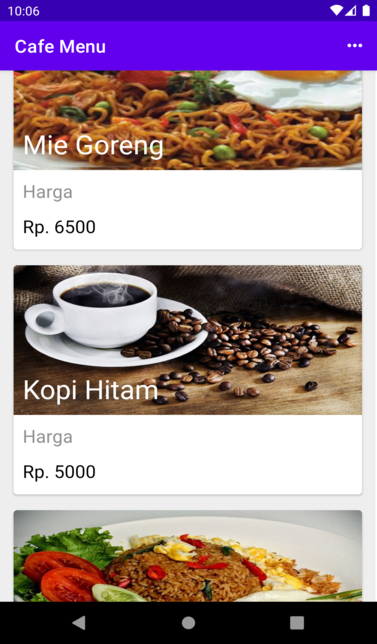

# # MenuCafe Description
[](https://android-arsenal.com/details/1/1234)

Untuk memenuhi syarat salah satu tugas `ujian akhir semester` mata kuliah ***Praktikum Pengembangan Aplikasi Mobile***.

## Username:
[](https://android-arsenal.com/details/1/1234)

```
test3@gmail.com
```

## Password:
[](https://android-arsenal.com/details/1/1234)

```
cek12345
```
# Results
[](https://android-arsenal.com/details/1/1234)

## 1. Login Layout


## 2. Menu Cafe

 Clik "Tambah Data" untuk memunculkan Menu


## 3. Detail Menu


## 4. Logout


